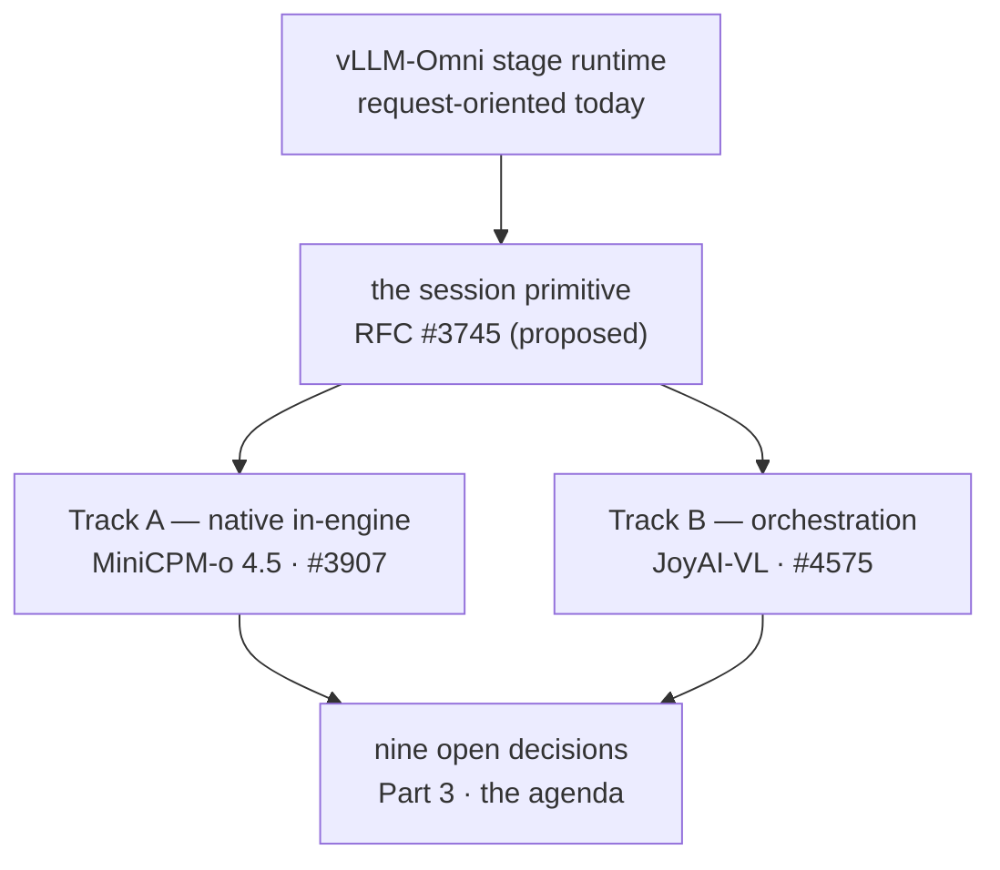
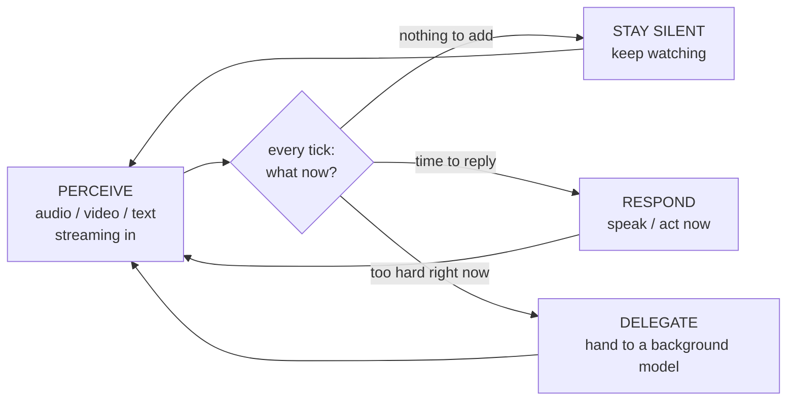
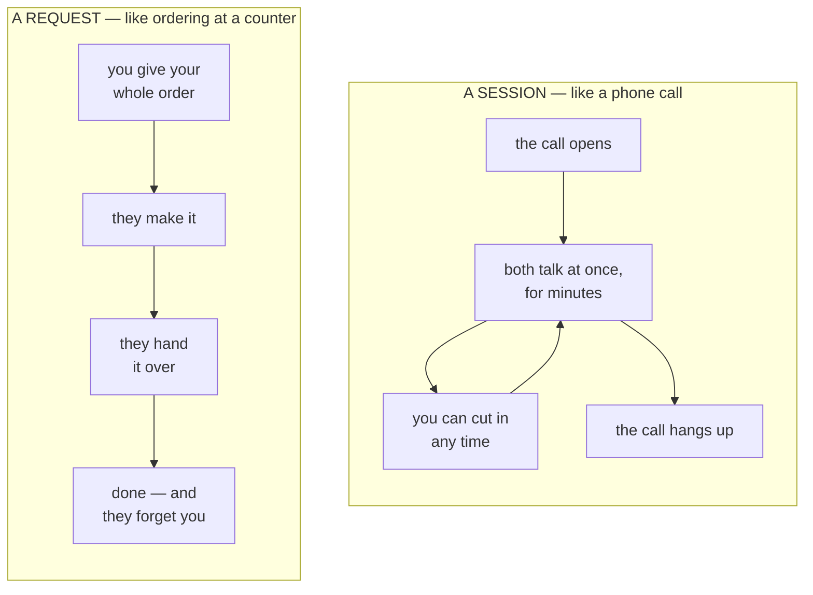
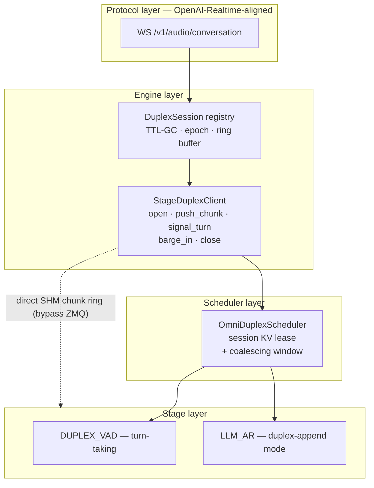
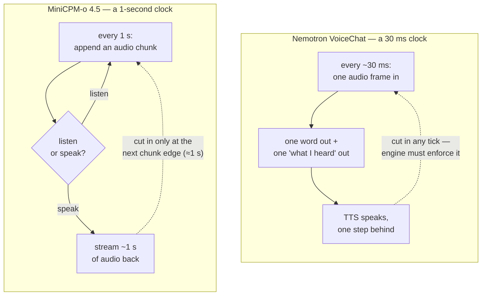
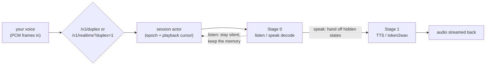
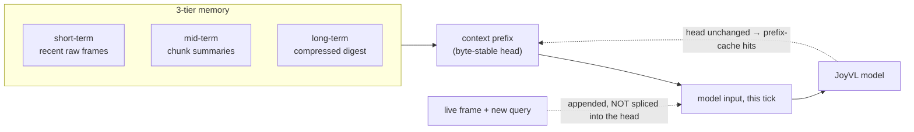
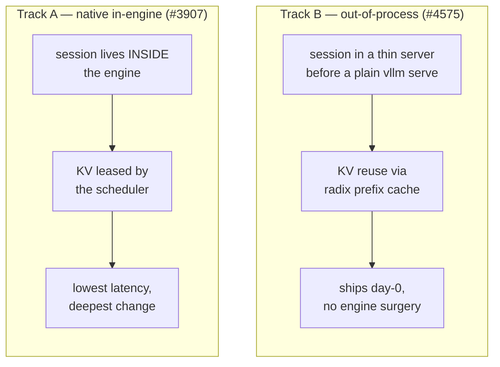
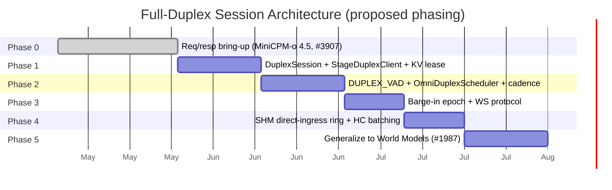

This is a **map, not a verdict**. Full-duplex interaction serving in vLLM-Omni is an active design — [RFC #3745](https://github.com/vllm-project/vllm-omni/issues/3745) is open, two implementations are landing from different directions, and several core questions are still being argued in the thread. The goal here is to lay out the shared ground everyone agrees on, then put the open decisions on the table — with their advocates — so the room has a common picture to argue from.

> **Short on time? Jump to [Part 3](#part-3).** The decision matrix there *is* the agenda — nine questions in three themes. Parts 1–2 are the shared context you need to argue them.

<div class="tldr">

**In one minute.** Interaction models (voice, vision) perceive and respond *at the same time* — and today's request-oriented engine can't serve them. Four things to hold onto:

- **The unit of work becomes the session, not the request** — the KV cache is leased to the whole call, not one reply.
- **Two implementations are landing from opposite ends** — MiniCPM-o 4.5 native *in* the engine (#3907); JoyAI-VL as orchestration *over* a plain server (#4575).
- **They each built their own `DuplexSession`** — the repo already has *two*, neither importing the other.
- **Nine decisions are open** (Part 3) — the agenda this post exists to frame.

</div>

<div class="toc">

**Contents** — [Part 1 · the common ground](#part-1) · [Part 2 · two implementations](#part-2) · [Part 3 · the decisions](#part-3)

</div>

The shape of the whole post, before the details:



## What we mean by full-duplex

Full-duplex voice is the "Doubao / Gemini Live / GPT-4o voice" experience: no push-to-talk, no turn button. You can interrupt the model mid-sentence, it listens and speaks at the same time, a single conversation context stays alive for minutes, and barge-in lands under 300–400 ms. A new class of models — MiniCPM-o 4.5 (Omni-Flow — perception and speech on one time-sliced clock), Nemotron VoiceChat, SoulX-Duplug, Moshi, PersonaPlex on the audio side; JoyAI-VL on the vision side — are **full-duplex by design**: they perceive and respond *concurrently*.

They are the edge of a broader shift Thinking Machines Lab calls [**interaction models**](https://thinkingmachines.ai/blog/interaction-models/): a model in "constant two-way exchange with the user — perceiving and responding at the same time," where "for interactivity to scale with intelligence, it must be part of the model itself." When interactivity becomes native to the *model*, the *serving stack* has to match it.

<figure>

<figcaption>Figure 1. The shift, in the MiniCPM-o 4.5 paper's terms (<a href="https://arxiv.org/abs/2604.27393">arXiv:2604.27393</a>, Fig. 3). Traditional streaming is <em>blocked</em> — perceive, then speak. Full-duplex overlaps "AI perceives" and "AI speaks" on one timeline, reacting ("…OH! He SHOOTS!") while still watching.</figcaption>
</figure>

Whatever the modality, an interaction model runs **one loop**: perceive continuously, and every tick decide whether to stay silent, respond now, or hand the hard part to a slower background model.



MiniCPM-o 4.5 calls the first two `⟨listen⟩` / `⟨speak⟩`; JoyAI-VL adds the third, `delegate`. The rest of this post is about what it takes to *serve* that loop.

---

<a id="part-1"></a>

# Part 1 — The common ground

This part is the picture nobody really disputes: why today's engine can't do it, and the shape of the primitive that the RFC proposes.

## How vLLM-Omni serves a request today

vLLM-Omni decomposes an any-to-any model into a **directed graph of stages** — each stage an independently served engine with its own scheduler and batching, wired to the next through a unified connector.

<figure>

<figcaption>Figure 2. vLLM-Omni architecture (<a href="https://arxiv.org/abs/2602.02204">arXiv:2602.02204</a>, Fig. 3). Each stage is an Exec Engine whose Model Runner loops <code>Schedule() → PreProcFn(req) → Forward(batch)</code> over its own <strong>Scheduler and KV Manager</strong> — the two boxes full-duplex has to change.</figcaption>
</figure>

Two substrate capabilities matter later: **streaming stage output (`async_chunk`)** — partial output streams to the next stage as it's produced, so the moment the Talker emits a token, Code2Wav turns it into a waveform — and a **control/data-plane-decoupled connector** (SHM or Mooncake).

<figure>

<figcaption>Figure 3. Async-chunk streaming (official meetup deck): the Thinker→Talker→Code2Wav chain emits <code>text_i</code> and <code>audio_i</code> as they're computed.</figcaption>
</figure>

**Qwen3-Omni** is the canonical example: a three-stage `Thinker(LLM) → Talker(LLM) → Code2Wav` pipeline that already *streams* beautifully (Figure 3) — the Talker emits a token, Code2Wav speaks it, overlapped. But it's still **turn-based**: you finish, *then* it thinks and replies. It's the model the counter serves perfectly — one request in, one streamed answer out, KV freed at the end. Full-duplex is the *same* stage graph asked to **listen while it speaks** — and that's where the counter breaks.

This substrate is strong — up to 91.4% lower job-completion time versus baseline. **But it is request-oriented.** A request goes `prefill → decode → finish`, and at finish its KV blocks return to the manager.

## The impedance mismatch

Today's engine treats a conversation like **ordering at a counter**; full-duplex needs **a phone call**.



Run a phone call through the counter and three things break:

<div class="table-caption">Table 1. What breaks, in plain terms.</div>
<table>
<thead><tr><th>What breaks</th><th>What full-duplex needs instead</th></tr></thead>
<tbody>
<tr><td>The model <strong>forgets everything</strong> the instant it finishes a reply</td><td>Keep the conversation's memory (its KV cache) alive for the <em>whole call</em></td></tr>
<tr><td>Go quiet for a moment and the engine <strong>drops you from the batch</strong></td><td>Hold your seat through the silences, so work still batches</td></tr>
<tr><td>The engine has <strong>no idea what "a conversation" or "whose turn it is"</strong> means</td><td>A <em>session</em> that owns turn-taking — and lets you interrupt mid-reply</td></tr>
</tbody>
</table>

<details><summary>For the curious: the six exact code sites RFC #3745 names</summary>

`_free_blocks` returns KV on finish; the streaming path resets `num_computed_tokens = 0` and re-prefills; a late chunk is pulled from the waiting queue (under-batching, ~½ throughput); `Orchestrator._route_output` finalizes on finish; the per-token audio chunk round-trips `core → client → core` over ZMQ (+3–5 ms/token); and `StageExecutionType` has no member that owns turn-taking.

</details>

The one-line framing everyone shares: **the unit of work should be the session, not the request.**

<div class="insight">

The unit of work becomes the **session**, not the request. The KV cache is leased to the whole call — a barge-in drops the half-spoken reply but never the memory.

</div>

## The proposed session primitive (RFC #3745)

The RFC proposes one primitive — `DuplexSession` — and a loop that never says "done":


The idea that makes it work: **the KV cache is leased to the call, not to a single reply.** A barge-in throws away the half-spoken answer but never the memory. The RFC sketches it as **four thin layers** — read the diagram top to bottom; it's the path one audio chunk takes:



Each layer fixes one of the three problems from earlier:

- **Protocol layer** — `WS /v1/audio/conversation`, an OpenAI-Realtime-aligned WebSocket carrying audio in *and* out on one long-lived connection. Deliberately thin: it just translates wire events into session calls and holds none of the hard logic.
- **Engine layer** — where the call lives. The **`DuplexSession` registry** is the new home for "a conversation": it keys sessions by id, holds the barge-in **epoch** and the input **ring buffer**, and reclaims idle sessions by TTL *(problem ③ — the engine finally has a notion of a conversation)*. The **`StageDuplexClient`** is the thin handle a model drives it through — `open / push_chunk / signal_turn / barge_in / close`.
- **Scheduler layer** — `OmniDuplexScheduler` does the two things the stock scheduler can't: it **holds the KV lease** so a session's blocks aren't freed between turns *(problem ① — no re-prefill)*, and runs the **coalescing window**, waiting a few ms so a momentarily-quiet stream still batches with its peers *(problem ② — no batch drop-out)*.
- **Stage layer** — the model itself. **`DUPLEX_VAD`** owns turn-taking — *is the user's turn over? is this a barge-in?* — and gates the **`LLM_AR`** stage, which runs in **duplex-append mode**: it *adds* the new chunk's tokens to the kept KV instead of re-prefilling.

The **dotted line is the latency shortcut**: audio chunks don't crawl down the layers over ZMQ — the `StageDuplexClient` writes them **straight into the stage-0 process through a shared-memory ring**, so only small control events (turn signals, barge-in) take the slow path. And every output chunk is stamped `(session, turn, epoch)`; a barge-in just bumps the epoch and stale chunks get dropped — but the KV lease is never touched.

A model plugs in at exactly one seam — the `StageDuplexClient`:

<details><summary>Code — the stage interface a model plugs into (RFC #3745)</summary>

```python
class StageDuplexClient(StagePoolClient, Protocol):
    def open_session(self, sid: str, params: DuplexSessionParams) -> None: ...
    def push_chunk(self, sid: str, chunk: DuplexChunk) -> None: ...        # SHM ring, not ZMQ
    def signal_turn(self, sid: str, event: TurnEvent) -> None: ...
    def barge_in(self, sid: str, epoch: int, scope: Literal["current", "all"]) -> None: ...
    def close_session(self, sid: str) -> None: ...
```

</details>

## One primitive, many model shapes

The reason a shared primitive is worth the trouble: full-duplex models share almost nothing structurally *except* needing persistent KV. Two audio models from the thread look nothing alike.

<div class="insight">

Full-duplex models share almost **nothing** structurally — except needing persistent KV. That's the one thing worth building once, and the reason a shared session primitive exists at all.

</div>

<figure>

<figcaption>Figure 4. MiniCPM-o 4.5's Omni-Flow (<a href="https://arxiv.org/abs/2604.27393">arXiv:2604.27393</a>, Fig. 4): env-visual, env-audio, and output streams share one millisecond timeline, sliced into 1-second chunks. Each chunk predicts a silent (<code>sl</code>) / speak (<code>sp</code>) token, then content.</figcaption>
</figure>

**MiniCPM-o 4.5** works on a **1-second clock**: a structured token group per chunk, learned `⟨listen⟩`/`⟨speak⟩`, barge-in only at chunk edges. **Nemotron VoiceChat** works on a **~30 ms clock**: one acoustic embedding per decode tick, one word + one "what I heard" token out, no boundary tokens, barge-in enforced engine-side.



These different clocks set hard **barge-in latency floors** and force a duplex adapter to support **three injection patterns**, not one:

<div class="table-caption">Table 2. Latency floors and injection patterns (per the RFC discussion).</div>
<table>
<thead><tr><th>Barge-in floor</th><th>Injection pattern</th><th>Example</th><th>Per-tick unit · terminator</th></tr></thead>
<tbody>
<tr><td>~1 s</td><td>Chunk-group append</td><td>MiniCPM-o 4.5</td><td>structured token group · learned <code>⟨chunk_eos⟩</code></td></tr>
<tr><td>~150–300 ms</td><td>Per-step tensor inject</td><td>Nemotron VoiceChat</td><td>one tensor at input embedding · none</td></tr>
<tr><td>~80 ms</td><td>Parallel-frame joint</td><td>Moshi-class / PersonaPlex</td><td>joint <code>(audio_in, audio_out)</code> · frame-clocked</td></tr>
</tbody>
</table>

---

<a id="part-2"></a>

# Part 2 — Two implementations, two directions

Two PRs are landing full-duplex from opposite ends of the spectrum. This part describes both, neutrally; the question of how they relate is in Part 3.

## Track A — audio, native in the engine (MiniCPM-o 4.5, #3907)

[PR #3907](https://github.com/vllm-project/vllm-omni/pull/3907) extends MiniCPM-o 4.5 into a session-oriented audio stream over `/v1/duplex` and `/v1/realtime?duplex=1`, with a real audio-in → audio-out data plane inside the engine:



Two beats carry the whole design. First, **barge-in keeps the memory**: `barge_in()` bumps the epoch and tears down only `stage_id > 0`, **preserving stage 0** — the resumable request that owns the conversation KV. "Drop the reply, keep the memory," literally in code. Second, a **playback cursor** commits to memory only what was actually *heard*, not what was streamed:


<div class="insight">

A barge-in tears down only the downstream stages and **keeps stage 0** — the one request that owns the conversation KV. "Drop the reply, keep the memory," literally in code. And **sent ≠ heard**: only *acknowledged* audio enters memory.

</div>

Net: #3907 **declares** the full capability surface (patterns, input modes, signal sources) but **defers** the scheduler-owned KV *lease* itself — today `supports_core_kv_lease` is a flag and stage 0 is simply kept resumable. Verified on H20: `stale_audio_delta_count=0` (barge-in really drops the stale stream).

<details><summary>Deep dive — Track A internals: the file walk, the session object, the code</summary>

**The path a chunk takes.** The PR is ~27k lines, but the duplex flow is a straight line through four files:

- `entrypoints/openai/serving_duplex.py` — the WebSocket handler: parse a frame, drive the session, emit `response.audio.delta`.
- `engine/duplex.py` — the session state + manager; routes the append through the duplex data plane, not a fake chat request.
- `models/minicpmo_4_5/duplex_runtime.py` + `duplex_policy.py` — Stage 0: MiniCPM's listen/speak decode, via the `worker/native_duplex.py` hooks.
- `minicpmo_4_5_omni_tts.py` — Stage 1: on `speak`, Stage 0's hidden states hand off to TTS / token2wav.

**The session object — `DuplexSessionRuntimeState`** (one per call, held by `DuplexSessionRuntimeManager`) owns four things: one long-lived resumable request per stage (`bind_stage_request`); a declared capability surface (`append_input` rejects any undeclared `DuplexInputMode`); the playback cursor (`acknowledge_playback`); and the barge-in rule:

```python
def barge_in(self) -> tuple[int, list[str]]:
    # Stage0 is the long-lived resumable request that owns the conversation
    # KV/context. A barge-in stops downstream output but PRESERVES stage0 so
    # conversation memory survives. Only stage_id > 0 are torn down.
    stale = [b.request_id for sid, b in self.stage_bindings.items() if sid != 0]
    self.epoch += 1
    self.pending_inputs.clear()
    self.stage_bindings = {sid: b for sid, b in self.stage_bindings.items() if sid == 0}
    return self.epoch, stale
```

The capability surface is the heart of the design — a model declares its shape, the runtime adapts:

```python
class DuplexAdapterPattern(str, Enum):
    CHUNK_GROUP_APPEND = "chunk_group_append"          # MiniCPM-o 4.5
    PER_STEP_TENSOR_INJECT = "per_step_tensor_inject"  # Nemotron VoiceChat
    PARALLEL_FRAME_JOINT = "parallel_frame_joint"      # Moshi-class

class DuplexInputMode(str, Enum):                      # append is one mode among several (decision ⑤)
    APPEND_AUDIO_CHUNK = "append_audio_chunk"
    REPLACE_LATEST_CHUNK = "replace_latest_chunk"
    REENCODE_CONTEXT = "reencode_context"
    ROLLBACK_TO_CHECKPOINT = "rollback_to_checkpoint"
    TURN_COMMIT_ONLY = "turn_commit_only"

class DuplexSignalSource(str, Enum):                   # turn-taking from many sources (decision ③)
    MODEL_NATIVE = "model_native"
    EXTERNAL_VAD = "external_vad"
    CLIENT_EVENT = "client_event"
    SERVER_POLICY = "server_policy"
    DIALOGUE_STATE_MODEL = "dialogue_state_model"
```

**The playback cursor — four watermarks.** `DuplexPlaybackCommitCursor` keeps `generated → sent → played → committed`; only `committed` enters memory:

```python
def mark_generated(self, generated_ms): self.generated_ms = max(self.generated_ms, generated_ms)
def mark_sent(self, sent_ms):           self.sent_ms      = max(self.sent_ms, sent_ms)
def acknowledge(self, played_ms, committed_ms=None):
    self.played_ms    = max(self.played_ms, played_ms)
    self.committed_ms = max(self.committed_ms, committed_ms if committed_ms is not None else played_ms)
```

</details>

## Track B — vision, orchestration over a plain server (JoyAI-VL, #4575)

The audio track isn't the only one. [JoyAI-VL-Interaction](https://arxiv.org/abs/2606.14777) is a **vision-first** interaction model: an 8B Qwen3-VL-shaped model retrained so that *deciding when to speak is a learned capability*. Watching video at 1 Hz, every second it emits `</silence>` (keep watching), `</response>` (speak now), or **delegates** to a background model — the loop from the intro, triggered by what it *sees*.

[PR #4575](https://github.com/vllm-project/vllm-omni/pull/4575) lands its serving layer — and takes the **opposite road** from #3907. Instead of a native in-engine session, it's a thin **out-of-process orchestrator** in front of a plain `vllm serve`, leaning on vLLM's automatic radix prefix cache for KV reuse.

It lives under `vllm_omni/experimental/fullduplex/`, and the split is worth getting right (the README is explicit about it):

- **`joyvl/serving/` is the live path** — an `InteractionSession` driving `decision/` (the silence / respond / delegate policy) and a 3-tier `memory/` (raw frames → text summaries → compressed long-term, shaped for prefix-cache reuse) **directly**, with `bridges/` for pluggable ASR / TTS + background delegation.
- **`core/`** (`DuplexRuntime` / `DuplexSession` / `DuplexAdapter`) is a **model-agnostic scaffold** — a demonstration of how a model *would* plug into a generic full-duplex framework, exercised only by tests today. Per its own README it's "built for" fused-audio models like MiniCPM-o — which is exactly the irony in decision ① below: #3907 built its own instead of using it.

<details><summary>Code — the generic adapter seam (core/adapter.py — a demonstration, test-only)</summary>

```python
class DuplexAdapter(ABC):
    @abstractmethod
    def capabilities(self) -> DuplexCapability: ...
    @abstractmethod
    async def on_input(self, session, modality: str, data) -> None: ...
    @abstractmethod
    def respond(self, session) -> AsyncIterator[OutputChunk]: ...

    def should_respond(self, session) -> bool:        # default: always
        return True
    async def on_barge_in(self, session) -> None: ...
    async def on_playback_ack(self, session, cursor: int) -> None: ...
```

Note this `core/` `DuplexAdapter` is a *second*, independent abstraction from #3907's — and a test-only scaffold, not JoyVL's live path. See decision ① in Part 3.

</details>

<figure>

<figcaption>Figure 5. JoyAI-VL's deployable system (<a href="https://arxiv.org/abs/2606.14777">arXiv:2606.14777</a>, Fig. 3): a browser/RTSP client → live web backend → inference adapter → the interaction model + background brain + long-horizon memory. The model is the only component that decides when to speak or delegate; everything else is transduction and orchestration around it.</figcaption>
</figure>

### Keeping the conversation contextualized

A two-hour stream never fits in the context window, so the orchestrator doesn't *grow* the input — every tick it **rebuilds a compact context prefix from memory and prepends it** to the live frame. The 3-tier brain feeds it:

- **short-term** — the last few raw frames (what's happening *now*);
- **mid-term** — text summaries of older chunks, each tagged with its frame range;
- **long-term** — a compressed digest of the whole session.



`build_memory_prefix` stitches these into one text block — *video history* (long-term + mid-term) + *Q&A history* + the *standing query* — that rides in front of the frame. The subtle part is what it **withholds**: a *newly issued* query is **not** spliced into the head; it goes into the current tick's appended message instead. That keeps the head byte-identical across ticks, so vLLM's radix prefix cache hits and the growing history is never re-prefilled — Track B's entire KV-reuse strategy in one rule.

<div class="insight">

**Withhold the new query from the byte-stable head.** The prefix stays identical across ticks → vLLM's radix prefix cache hits → the hours-long history is never re-prefilled. That single rule *is* Track B's KV-reuse strategy.

</div>

<details><summary>Code — assembling the context prefix (joyvl/memory/memory.py)</summary>

```python
def build_memory_prefix(memory, *, current_query, query_in_current_chunk,
                        keep_qa_history, current_chunk_index) -> str:
    sections = []
    # 1) video history = long-term digest + mid-term chunk summaries
    history = []
    if current_query and memory.long_term_memory:
        history.append(memory.long_term_memory)
    for e in memory.mid_term_summaries:
        history.append(f"<{e.frame_range}>\n{e.summary_text}")
    if history:
        sections.append(VIDEO_HISTORY_HEADER + "\n\n".join(history))
    # 2) past Q&A, archived before this chunk
    if keep_qa_history and current_query:
        sections.append(QA_HISTORY_HEADER + qa_lines)   # "[Q@t] … [A@t] …"
    # 3) the standing query — ONLY if it is not already in the current chunk
    if current_query and not query_in_current_chunk:
        sections.append(USER_QUERY_HEADER + "\n" + current_query.strip())
    return "\n\n".join(sections)
```

</details>

The two tracks differ on where the session lives and how KV is reused:



---

<a id="part-3"></a>

# Part 3 — What we're deciding (the agenda)

This is the open part. Nine questions are live in the [RFC #3745](https://github.com/vllm-project/vllm-omni/issues/3745) thread; none is settled. Here they are in one view, then grouped into three themes — **Structure**, **Semantics**, **Targets** — each with the concrete code that makes the fork real.

<div class="table-caption">The decision matrix — the whole agenda on one screen.</div>
<table>
<thead><tr><th>#</th><th>Decision</th><th>Options on the table</th><th>Argued by</th><th>Status</th></tr></thead>
<tbody>
<tr><td>①</td><td>One session core, or two?</td><td>converge · keep two · one API / two backends</td><td>RFC intent vs #3907 &amp; #4575</td><td><strong>two already shipped</strong></td></tr>
<tr><td>②</td><td>Native engine vs orchestration</td><td>two backends of one core · native is the destination · two tracks</td><td>#3907, #4575</td><td>open</td></tr>
<tr><td>⑥</td><td>Where session management lives</td><td>orchestrator · coordinator · separate layer · new orchestrator type · engine↔executor wrapper</td><td>yinpeiqi, Gaohan, TKONIY, Nightwing-77</td><td>open</td></tr>
<tr><td>⑧</td><td>One home for all models?</td><td><code>experimental/fullduplex/</code> as adapters · stay put</td><td>open call</td><td>split today</td></tr>
<tr><td>③</td><td>Who owns turn-taking</td><td>DUPLEX_VAD only · optional (self-VAD) · multi-source TurnController</td><td>tc-mb, Sy0307</td><td>open</td></tr>
<tr><td>④</td><td>KV-lease scope &amp; eviction</td><td>stage-0 only vs all · reject / evict / compress</td><td>yinpeiqi, author</td><td>open</td></tr>
<tr><td>⑤</td><td>Append semantics</td><td>default mode · one declared capability among many</td><td>Sy0307, linyueqian</td><td>open</td></tr>
<tr><td>⑦</td><td>Single- vs multi-session first</td><td>single first, then scale</td><td>tc-mb (+ several)</td><td>leaning single</td></tr>
<tr><td>⑨</td><td>Latency tiers &amp; function calling</td><td>pin a barge-in floor per phase · keep ZMQ+SHM swappable</td><td>linyueqian, vklimkov, Liangtaiwan</td><td>open</td></tr>
</tbody>
</table>

## Theme 1 — Structure: how many abstractions, and where? (①②⑥⑧)

The headline fact: the repo already holds **session abstractions that don't share code** — and the one *meant* to be reusable (`core/`) isn't even on JoyVL's live path:

```python
# #3907 (MiniCPM, native) — the live session:
from vllm_omni.engine.duplex import DuplexSessionRuntimeState
# #4575 (JoyVL, orchestration) — the live session:
from vllm_omni.experimental.fullduplex.joyvl.serving.session import InteractionSession
# #4575 also ships a generic scaffold, built "for fused-audio models like MiniCPM-o" —
# yet #3907 built its own and never used it:
from vllm_omni.experimental.fullduplex.core import DuplexSession   # demonstration / tests only
```

<div class="insight">

`core/` was built "for fused-audio models like MiniCPM-o" — and **MiniCPM-o built its own instead.** The fragmentation RFC #3745 set out to prevent has already happened.

</div>

- **①** converge into one model-agnostic core · keep two (native-audio vs orchestration-vision) · one shared API with two backends.
- **②** treat native (#3907) and orchestration (#4575) as two backends of one core, chosen by latency tier · native as the destination, orchestration the day-0 stopgap · two independent tracks.
- **⑥** where the session object lives — orchestrator main path · the coordinator (yinpeiqi) · a separate layer · a new session-based orchestrator type (Gaohan) · a wrapper between engine and executor (Nightwing-77); boundaries flagged unclear (TKONIY).
- **⑧** whether every model moves under `experimental/fullduplex/` as a capability-declaring adapter, or stays put (today #3907 is in `model_executor` + `entrypoints`; #4575/#4771 are under `experimental/fullduplex`).

## Theme 2 — Semantics: turn-taking, KV lease, append (③④⑤)

Two of these are *already enums in #3907* — so the fork isn't "invent something," it's "which members become canonical and required."

```python
class DuplexSignalSource(str, Enum):   # ③ — who may declare a "turn"?
    MODEL_NATIVE = "model_native"
    EXTERNAL_VAD = "external_vad"
    CLIENT_EVENT = "client_event"
    SERVER_POLICY = "server_policy"
    DIALOGUE_STATE_MODEL = "dialogue_state_model"

class DuplexInputMode(str, Enum):      # ⑤ — is "append" the default, or one of these?
    APPEND_AUDIO_CHUNK = "append_audio_chunk"
    REPLACE_LATEST_CHUNK = "replace_latest_chunk"
    REENCODE_CONTEXT = "reencode_context"
    ROLLBACK_TO_CHECKPOINT = "rollback_to_checkpoint"
    TURN_COMMIT_ONLY = "turn_commit_only"
```

- **③** is `DUPLEX_VAD` the single owner · optional, since an end-to-end model self-VADs (tc-mb) · or one of *many* sources behind a `TurnController` (Sy0307)?
- **④** does the KV lease cover stage-0/thinker only — downstream stages are epoch-flushable (yinpeiqi) — or all stages? Under memory pressure: reject + TTL-GC · evict oldest · compress (sink+window)?
- **⑤** is append the default, or one *declared capability* among several, gated by `session_mode: turn | duplex` so the six existing TTS pipelines never regress (Sy0307, linyueqian)?

## Theme 3 — Targets: scope and latency (⑦⑨)

- **⑦** single-session first — land the primitive shape before admission control / fairness (tc-mb, agreed by several).
- **⑨** pin each phase to a barge-in floor it commits to (≈1 s / 300 ms / 80 ms). Sub-300 ms needs sub-chunk cancel + `audio_end_ms` truncate + mandatory VAD (linyueqian). Keep `core ↔ client` transports (ZMQ + SHM) swappable for closed-loop function calling — run the thinker with no user input to produce a call, then "prefill in the middle" (vklimkov-nvidia). Lockstep models need a non-token side-channel payload + a frame-budgeted stop + a deploy-time prewarm pass (Liangtaiwan).

## Phases, as proposed

The RFC sketches a phased rollout; how the phases map to the open decisions above is part of what's being discussed.



Phase 5 makes `DuplexChunk` an opaque typed payload so a World-Model (#1987) observe→predict loop could reuse the same `DuplexSession` — one session system, not two. Full-duplex sits at **P1** on the public roadmap ([issue #2136](https://github.com/vllm-project/vllm-omni/issues/2136)).

---

*Sources: RFC [#3745](https://github.com/vllm-project/vllm-omni/issues/3745) and its discussion thread; PRs [#3907](https://github.com/vllm-project/vllm-omni/pull/3907) (MiniCPM-o 4.5) and [#4575](https://github.com/vllm-project/vllm-omni/pull/4575) (JoyAI-VL); the MiniCPM-o 4.5 paper ([arXiv:2604.27393](https://arxiv.org/abs/2604.27393), Figs. 1 & 4); the JoyAI-VL-Interaction paper ([arXiv:2606.14777](https://arxiv.org/abs/2606.14777), Fig. 5); the vLLM-Omni systems paper ([arXiv:2602.02204](https://arxiv.org/abs/2602.02204), Fig. 2) and the Apr-2026 meetup deck (Fig. 3). All views attributed to named contributors are theirs, from the public thread. Project: [github.com/vllm-project/vllm-omni](https://github.com/vllm-project/vllm-omni).*
