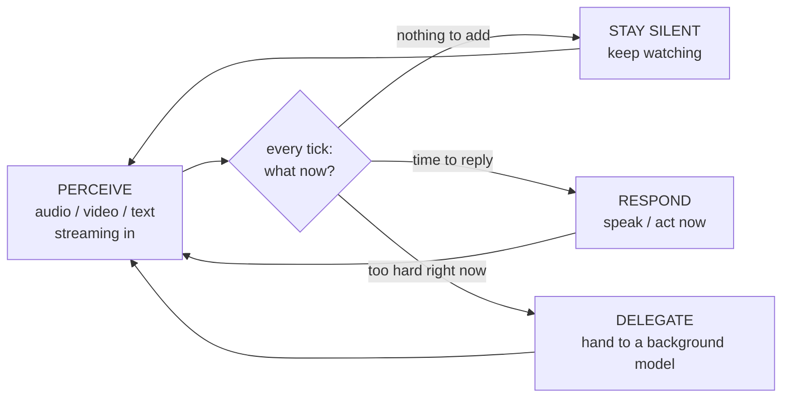
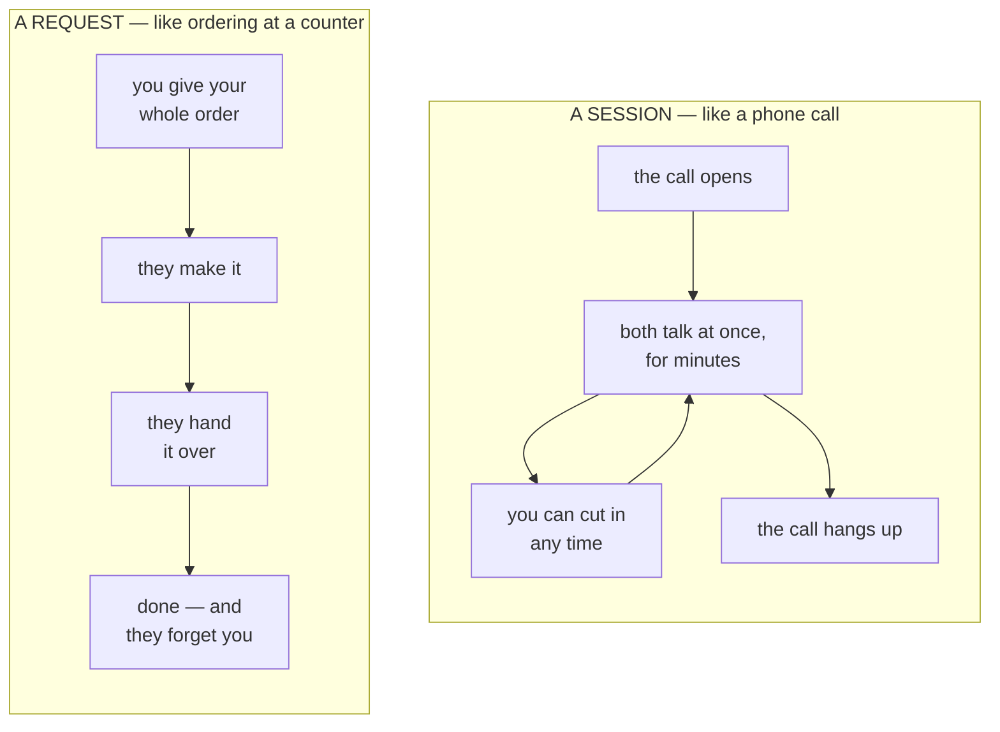
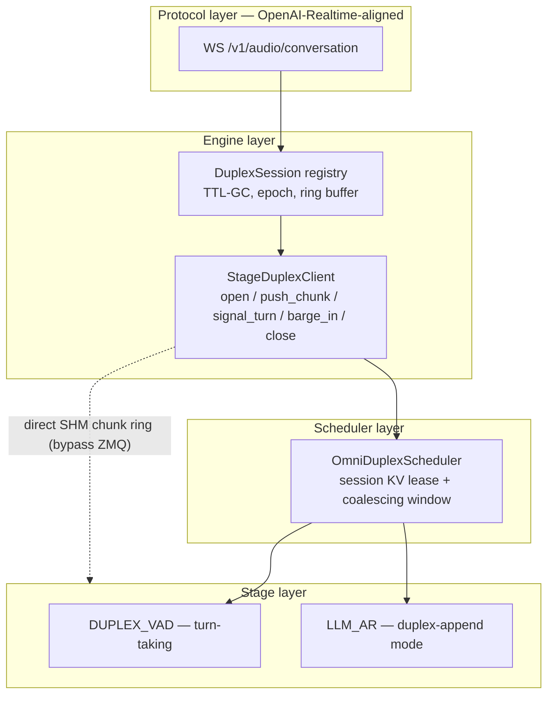
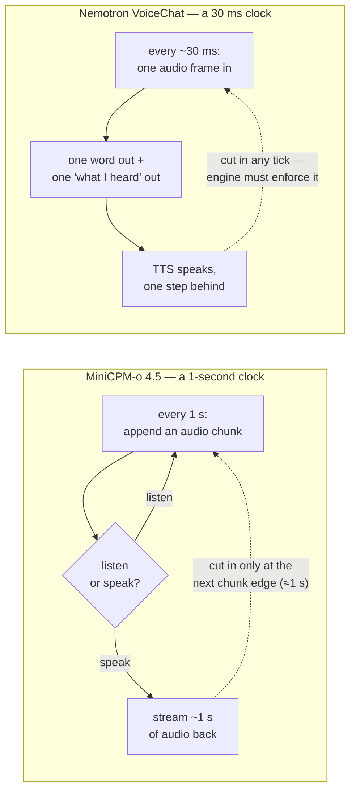
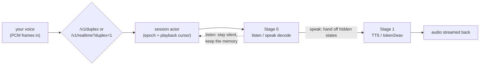
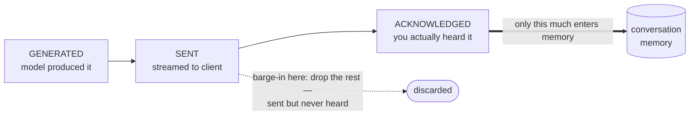
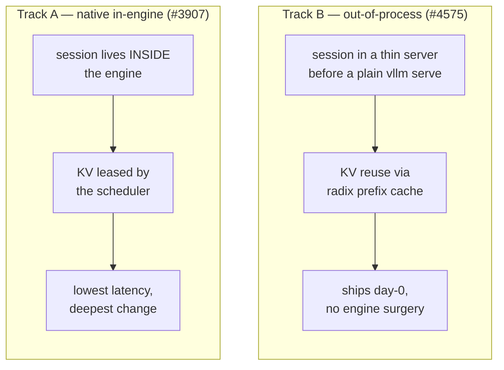
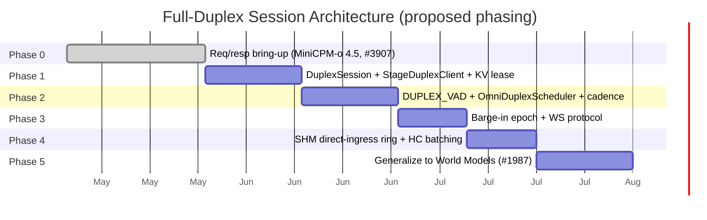

This is a **map, not a verdict**. Full-duplex interaction serving in vLLM-Omni is an active design — [RFC #3745](https://github.com/vllm-project/vllm-omni/issues/3745) is open, two implementations are landing from different directions, and several core questions are still being argued in the thread. The goal here is to lay out the shared ground everyone agrees on, then put the open decisions on the table — with their advocates — so the room has a common picture to argue from.

## What we mean by full-duplex

Full-duplex voice is the "Doubao / Gemini Live / GPT-4o voice" experience: no push-to-talk, no turn button. You can interrupt the model mid-sentence, it listens and speaks at the same time, a single conversation context stays alive for minutes, and barge-in lands under 300–400 ms. A new class of models — MiniCPM-o 4.5 (Omni-Flow), Nemotron VoiceChat, SoulX-Duplug, Moshi, PersonaPlex on the audio side; JoyAI-VL on the vision side — are **full-duplex by design**: they perceive and respond *concurrently*.

They are the edge of a broader shift Thinking Machines Lab calls [**interaction models**](https://thinkingmachines.ai/blog/interaction-models/): a model in "constant two-way exchange with the user — perceiving and responding at the same time," where "for interactivity to scale with intelligence, it must be part of the model itself." When interactivity becomes native to the *model*, the *serving stack* has to match it.

<figure>

<figcaption>Figure 1. The shift, in the MiniCPM-o 4.5 paper's terms (<a href="https://arxiv.org/abs/2604.27393">arXiv:2604.27393</a>, Fig. 3). Traditional streaming is <em>blocked</em> — perceive, then speak. Full-duplex overlaps "AI perceives" and "AI speaks" on one timeline, reacting ("…OH! He SHOOTS!") while still watching.</figcaption>
</figure>

Whatever the modality, an interaction model runs **one loop**: perceive continuously, and every tick decide whether to stay silent, respond now, or hand the hard part to a slower background model.

MiniCPM-o 4.5 calls the first two `⟨listen⟩` / `⟨speak⟩`; JoyAI-VL adds the third, `delegate`. The rest of this post is about what it takes to *serve* that loop.

---

# Part 1 — The common ground

This part is the picture nobody really disputes: why today's engine can't do it, and the shape of the primitive that the RFC proposes.

## How vLLM-Omni serves a request today

vLLM-Omni decomposes an any-to-any model into a **directed graph of stages** — each stage an independently served engine with its own scheduler and batching, wired to the next through a unified connector.

<figure>

<figcaption>Figure 2. vLLM-Omni architecture (<a href="https://arxiv.org/abs/2602.02204">arXiv:2602.02204</a>, Fig. 3). Each stage is an Exec Engine whose Model Runner loops <code>Schedule() → PreProcFn(req) → Forward(batch)</code> over its own <strong>Scheduler and KV Manager</strong> — the two boxes full-duplex has to change.</figcaption>
</figure>

Two substrate capabilities matter later: **streaming stage output (`async_chunk`)** — partial output streams to the next stage as it's produced, so the moment the Talker emits a token, Code2Wav turns it into a waveform — and a **control/data-plane-decoupled connector** (SHM or Mooncake).

<figure>

<figcaption>Figure 3. Async-chunk streaming (official meetup deck): the Thinker→Talker→Code2Wav chain emits <code>text_i</code> and <code>audio_i</code> as they're computed.</figcaption>
</figure>

This substrate is strong — up to 91.4% lower job-completion time versus baseline. **But it is request-oriented.** A request goes `prefill → decode → finish`, and at finish its KV blocks return to the manager.

## The impedance mismatch

Today's engine treats a conversation like **ordering at a counter**; full-duplex needs **a phone call**.

Run a phone call through the counter and three things break:

Table 1. What breaks, in plain terms.

<table>
<thead><tr><th>What breaks</th><th>What full-duplex needs instead</th></tr></thead>
<tbody>
<tr><td>The model <strong>forgets everything</strong> the instant it finishes a reply</td><td>Keep the conversation's memory (its KV cache) alive for the <em>whole call</em></td></tr>
<tr><td>Go quiet for a moment and the engine <strong>drops you from the batch</strong></td><td>Hold your seat through the silences, so work still batches</td></tr>
<tr><td>The engine has <strong>no idea what "a conversation" or "whose turn it is"</strong> means</td><td>A <em>session</em> that owns turn-taking — and lets you interrupt mid-reply</td></tr>
</tbody>
</table>

For the curious: the six exact code sites RFC #3745 names

`_free_blocks` returns KV on finish; the streaming path resets `num_computed_tokens = 0` and re-prefills; a late chunk is pulled from the waiting queue (under-batching, ~½ throughput); `Orchestrator._route_output` finalizes on finish; the per-token audio chunk round-trips `core → client → core` over ZMQ (+3–5 ms/token); and `StageExecutionType` has no member that owns turn-taking.

The one-line framing everyone shares: **the unit of work should be the session, not the request.**

## The proposed session primitive (RFC #3745)

The RFC proposes one primitive — `DuplexSession` — and a loop that never says "done":

The idea that makes it work: **the KV cache is leased to the call, not to a single reply.** A barge-in throws away the half-spoken answer but never the memory. The RFC sketches it as four thin layers:

The load-bearing pieces: a **KV lease** (blocks not freed on segment finish, only on close), **duplex-append mode** (keep `num_computed_tokens`, extend the block table), an **adaptive coalescing window** (wait briefly so late chunks still batch), a **SHM direct-ingress ring** (skip the ZMQ round-trip), and **epoch barge-in** (every chunk carries `(session, turn, epoch)`; a barge-in bumps the epoch and stages drop stale work — never the KV).

## One primitive, many model shapes

The reason a shared primitive is worth the trouble: full-duplex models share almost nothing structurally *except* needing persistent KV. Two audio models from the thread look nothing alike.

<figure>

<figcaption>Figure 4. MiniCPM-o 4.5's Omni-Flow (<a href="https://arxiv.org/abs/2604.27393">arXiv:2604.27393</a>, Fig. 4): env-visual, env-audio, and output streams share one millisecond timeline, sliced into 1-second chunks. Each chunk predicts a silent (<code>sl</code>) / speak (<code>sp</code>) token, then content.</figcaption>
</figure>

**MiniCPM-o 4.5** works on a **1-second clock**: a structured token group per chunk, learned `⟨listen⟩`/`⟨speak⟩`, barge-in only at chunk edges. **Nemotron VoiceChat** works on a **~30 ms clock**: one acoustic embedding per decode tick, one word + one "what I heard" token out, no boundary tokens, barge-in enforced engine-side.

These different clocks set hard **barge-in latency floors** and force a duplex adapter to support **three injection patterns**, not one:

Table 2. Latency floors and injection patterns (per the RFC discussion).

<table>
<thead><tr><th>Barge-in floor</th><th>Injection pattern</th><th>Example</th><th>Per-tick unit · terminator</th></tr></thead>
<tbody>
<tr><td>~1 s</td><td>Chunk-group append</td><td>MiniCPM-o 4.5</td><td>structured token group · learned <code>⟨chunk_eos⟩</code></td></tr>
<tr><td>~150–300 ms</td><td>Per-step tensor inject</td><td>Nemotron VoiceChat</td><td>one tensor at input embedding · none</td></tr>
<tr><td>~80 ms</td><td>Parallel-frame joint</td><td>Moshi-class / PersonaPlex</td><td>joint <code>(audio_in, audio_out)</code> · frame-clocked</td></tr>
</tbody>
</table>

---

# Part 2 — Two implementations, two directions

Two PRs are landing full-duplex from opposite ends of the spectrum. This part describes both, neutrally; the question of how they relate is in Part 3.

## Track A — audio, native in the engine (MiniCPM-o 4.5, #3907)

[PR #3907](https://github.com/vllm-project/vllm-omni/pull/3907) extends MiniCPM-o 4.5 into a session-oriented audio stream over `/v1/duplex` and `/v1/realtime?duplex=1`, with a real audio-in → audio-out data plane inside the engine:

Its session primitive lives in **`engine/duplex.py`**, and the type system reads like a checklist of the review feedback (see Part 3): `SessionMode`, `DuplexAdapterPattern`, `DuplexInputMode`, `DuplexSignalSource`, `DuplexRuntimeCapabilities`, `DuplexPlaybackCommitCursor`, `DuplexStageBinding`, `DuplexSessionRuntimeState/Manager`.

One concept worth a picture — the **playback cursor**: the model commits to memory only what you *actually heard*, not what it streamed. A barge-in cuts the line between "sent" and "heard."

#3907 explicitly **defers** the full scheduler-owned KV lease (allocation / rollback / migration / release), landing the control semantics first. Its H20 end-to-end run reports `overlap_listen=true`, `playback_commit_ok=true`, and `stale_audio_delta_count=0` (barge-in drops the stale stream).

## Track B — vision, orchestration over a plain server (JoyAI-VL, #4575)

The audio track isn't the only one. [JoyAI-VL-Interaction](https://arxiv.org/abs/2606.14777) is a **vision-first** interaction model: an 8B Qwen3-VL-shaped model retrained so that *deciding when to speak is a learned capability*. Watching video at 1 Hz, every second it emits `</silence>` (keep watching), `</response>` (speak now), or **delegates** to a background model — the loop from the intro, triggered by what it *sees*.

[PR #4575](https://github.com/vllm-project/vllm-omni/pull/4575) lands its serving layer — and takes the **opposite road** from #3907. Instead of a native in-engine session, it's a thin **out-of-process orchestrator** in front of a plain `vllm serve`, leaning on vLLM's automatic radix prefix cache for KV reuse. It lives under `vllm_omni/experimental/fullduplex/`: a model-agnostic `core/` (`DuplexRuntime` / `DuplexSession` / `DuplexAdapter`, epoch barge-in, streaming) plus a `joyvl/` implementation — `decision/` (the silence/respond/delegate policy), a 3-tier `memory/` (raw frames → text summaries → compressed long-term, shaped for prefix-cache reuse), `serving/` (the OpenAI-compatible orchestrator), and `bridges/` (pluggable ASR/TTS + background delegation).

<figure>

<figcaption>Figure 5. JoyAI-VL's deployable system (<a href="https://arxiv.org/abs/2606.14777">arXiv:2606.14777</a>, Fig. 3): a browser/RTSP client → live web backend → inference adapter → the interaction model + background brain + long-horizon memory. The model is the only component that decides when to speak or delegate; everything else is transduction and orchestration around it.</figcaption>
</figure>

The two tracks differ on where the session lives and how KV is reused:

---

# Part 3 — What's still open

Here are the live forks from the RFC thread, presented as options with their advocates. None is settled; this is the agenda for the room.

**① We already have two `DuplexSession` abstractions.** #3907 built one in `engine/duplex.py`; #4575 built another in `experimental/fullduplex/core/`. Neither uses the other — the exact fragmentation the RFC set out to prevent.
- **(A)** Converge into one model-agnostic core. **(B)** Keep two (native-audio vs orchestration-vision). **(C)** One shared API, two backend implementations.
- *In the thread:* the RFC's stated goal is "define the primitive once"; in practice two shipped independently.

**② Native engine vs out-of-process orchestration.**
- **(A)** Two backends of one core, chosen by latency tier. **(B)** Native is the destination, orchestration the day-0 stopgap. **(C)** Two independent tracks for two use-cases.

**③ Who owns turn-taking?**
- **(A)** `DUPLEX_VAD` is the single owner. **(B)** Optional — an end-to-end model self-VADs; VAD only for cascades (tc-mb). **(C)** A `TurnController` fed by *multiple* signal sources — VAD, model token, client event, server policy (Sy0307).

**④ KV lease — scope and eviction.**
- *Scope:* stage-0/thinker only (downstream stages are epoch-flushable — yinpeiqi) vs all session stages.
- *Under memory pressure:* reject new + TTL-GC, vs evict oldest session, vs compress (sink+window). (author's open question)

**⑤ Append semantics.**
- **(A)** Append is the default input mode. **(B)** Append is one *declared capability* among several (replace-latest / re-encode / rollback), gated by `session_mode: turn | duplex` so the six existing TTS pipelines never regress (Sy0307, linyueqian).

**⑥ Where session management lives.**
- Orchestrator main path · folded into the Coordinator (yinpeiqi) · a separate layer/process · a new session-based orchestrator type (Gaohan) · a wrapper between engine and model executor (Nightwing-77). Naming/boundaries flagged as unclear (TKONIY).

**⑦ Single-session first, or multi-session in Phase 1?**
- Broad lean toward single-session first — land the primitive shape before admission control / fairness (tc-mb, agreed by several).

**⑧ One home for all full-duplex models?**
- Should every model live under `experimental/fullduplex/` as a capability-declaring adapter, or stay where it is (today #3907 is in `model_executor` + `entrypoints`, #4575/#4771 are under `experimental/fullduplex`)?

**⑨ Latency tiers and function calling.**
- Pin each phase to a barge-in floor it commits to — sub-300 ms needs sub-chunk cancel + `audio_end_ms` truncate + mandatory VAD (linyueqian). Keep `core ↔ client` transports (ZMQ + SHM) interchangeable for closed-loop function calling — running the thinker without user input to produce a call, then "prefilling in the middle" (vklimkov-nvidia). And lockstep models (Liangtaiwan) need a non-token side-channel payload, a frame-budgeted stop, and a deploy-time prewarm pass.

## Phases, as proposed

The RFC sketches a phased rollout; how the phases map to the open decisions above is part of what's being discussed.

Phase 5 makes `DuplexChunk` an opaque typed payload so a World-Model (#1987) observe→predict loop could reuse the same `DuplexSession` — one session system, not two. Full-duplex sits at **P1** on the public roadmap ([issue #2136](https://github.com/vllm-project/vllm-omni/issues/2136)).

---

*Sources: RFC [#3745](https://github.com/vllm-project/vllm-omni/issues/3745) and its discussion thread; PRs [#3907](https://github.com/vllm-project/vllm-omni/pull/3907) (MiniCPM-o 4.5) and [#4575](https://github.com/vllm-project/vllm-omni/pull/4575) (JoyAI-VL); the MiniCPM-o 4.5 paper ([arXiv:2604.27393](https://arxiv.org/abs/2604.27393), Figs. 1 & 4); the JoyAI-VL-Interaction paper ([arXiv:2606.14777](https://arxiv.org/abs/2606.14777), Fig. 5); the vLLM-Omni systems paper ([arXiv:2602.02204](https://arxiv.org/abs/2602.02204), Fig. 2) and the Apr-2026 meetup deck (Fig. 3). All views attributed to named contributors are theirs, from the public thread. Project: [github.com/vllm-project/vllm-omni](https://github.com/vllm-project/vllm-omni).*
