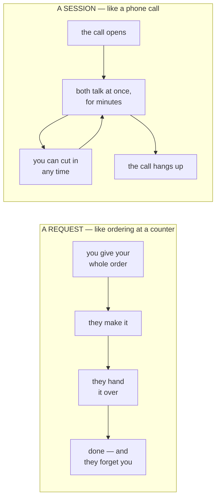
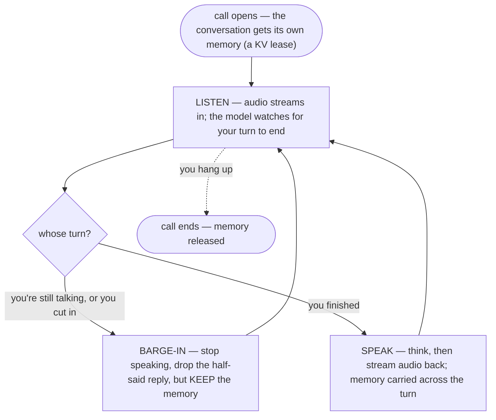
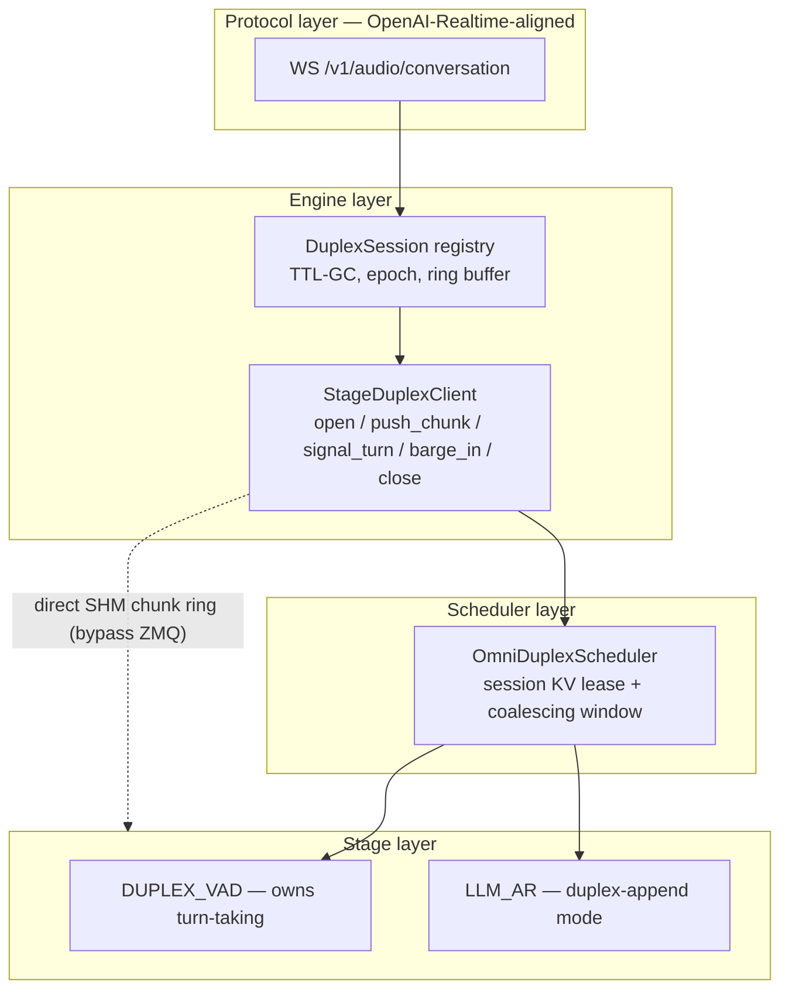
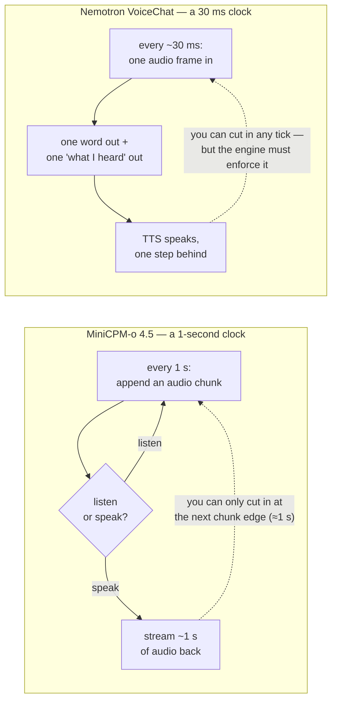
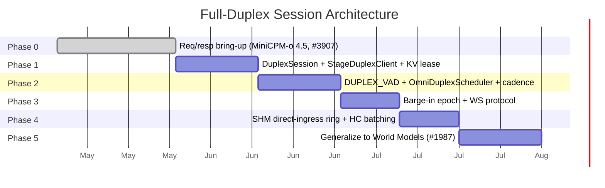

Full-duplex voice is the "Doubao / Gemini Live / GPT-4o voice" experience: no push-to-talk, no turn button. You can interrupt the model mid-sentence, it listens and speaks at the same time, a single conversation context stays alive for minutes, and barge-in lands under 300–400 ms. A new class of speech models — MiniCPM-o 4.5 (Omni-Flow / TDM), Nemotron VoiceChat (`nemotron_duplex_h`), SoulX-Duplug, Moshi, PersonaPlex — are **full-duplex by design**: they perceive and respond *concurrently*.

They are the speech edge of a broader shift that Thinking Machines Lab calls [**interaction models**](https://thinkingmachines.ai/blog/interaction-models/): a model in "constant two-way exchange with the user — perceiving and responding at the same time," where "for interactivity to scale with intelligence, it must be part of the model itself." But if interactivity becomes native to the *model*, the *serving stack* has to match it — and a request-oriented engine can't. That gap is what this post is about.

vLLM-Omni cannot serve this today, and not because an adapter was written wrong. There is a **structural impedance mismatch**: the runtime is request-oriented (`prompt → output → done`, KV freed at finish), while the models are stream-oriented (continuous audio in *while* generating out, conversation-lifetime KV). Three model PRs (MiniCPM-o 4.5, `nemotron_duplex_h`, SoulX-Duplug) independently hit the **same wall**, each at risk of growing its own ad-hoc streaming path.

[RFC #3745](https://github.com/vllm-project/vllm-omni/issues/3745) defines the duplex session primitive **once** and enumerates how each model conforms. This post walks through it: the substrate it builds on, the primitive itself, how the design review reshaped it across six model families, and how [PR #3907](https://github.com/vllm-project/vllm-omni/pull/3907) lands it for MiniCPM-o 4.5.

## Inside vLLM-Omni today: a disaggregated stage runtime

To see the mismatch you first have to see how vLLM-Omni serves a multimodal request *today*. It decomposes an any-to-any model into a **directed graph of stages**: each stage is an independently served engine with its own scheduler and batching, wired to the next through a unified connector.

<figure>

<figcaption>Figure 1. vLLM-Omni architecture (<a href="https://arxiv.org/abs/2602.02204">arXiv:2602.02204</a>, Fig. 3). Each stage is an Exec Engine whose Model Runner loops <code>Schedule() → PreProcFn(req) → Forward(batch)</code> over its own <strong>Scheduler and KV Manager</strong> — the two boxes full-duplex has to change.</figcaption>
</figure>

For Qwen3-Omni this graph instantiates as `Thinker(LLM) → Talker(LLM) → Vocoder(DiT)`, every forward `[Batched]`. Two substrate capabilities matter for what follows: **streaming stage output (`async_chunk`)** — partial output streams to the next stage incrementally, so the moment the Talker emits a token, Code2Wav turns it into a waveform — and a **control/data-plane-decoupled connector** (SHM or Mooncake) that the duplex design later reuses for its direct-ingress ring.

<figure>

<figcaption>Figure 2. Async-chunk streaming (official meetup deck): the Thinker→Talker→Code2Wav chain emits <code>text_i</code> and <code>audio_i</code> as they are computed.</figcaption>
</figure>

This substrate is strong — up to 91.4% lower job-completion time versus baseline. **But it is request-oriented.** A request goes `prefill → decode → finish`, and at finish its KV blocks return to the manager. Perfect for one-shot Q&A; for "listen and speak concurrently, context alive for minutes," it is the wall.

## The impedance mismatch

The simplest way to feel the mismatch: today's engine treats a conversation like **ordering at a counter**, but full-duplex needs it to behave like **a phone call**.

The engine was built for the counter. Run a phone call through it and three things break — and that's the whole story:

Table 1. What breaks, in plain terms.

<table>
<thead><tr><th>What breaks</th><th>What full-duplex needs instead</th></tr></thead>
<tbody>
<tr><td>The model <strong>forgets everything</strong> the instant it finishes a reply</td><td>Keep the conversation's memory (its KV cache) alive for the <em>whole call</em></td></tr>
<tr><td>Go quiet for a moment and the engine <strong>drops you from the batch</strong> — so the next words re-compute from scratch</td><td>Hold your seat through the silences, so work still batches efficiently</td></tr>
<tr><td>The engine has <strong>no idea what "a conversation" or "whose turn it is"</strong> even means</td><td>A <em>session</em> that owns turn-taking — and lets you interrupt mid-reply</td></tr>
</tbody>
</table>

For the curious: the six exact code sites RFC #3745 names

`_free_blocks` returns KV on finish; the streaming path resets `num_computed_tokens = 0` and re-prefills; a late chunk is pulled from the waiting queue (under-batching, ~½ throughput); `Orchestrator._route_output` finalizes on finish; the per-token audio chunk round-trips `core → client → core` over ZMQ (+3–5 ms/token); and `StageExecutionType` has no member that owns turn-taking. The three plain-language problems above are exactly these six, grouped.

The thesis in one line: **the unit of work is the session, not the request.** The Thinker's KV is leased to the session and survives every turn; barge-in flushes downstream stages and bumps an epoch but never frees the conversation KV.

## The session primitive (RFC #3745)

The target experience is a loop that never says "done" — listen, decide whose turn it is, speak, and let the user cut in at any moment:

The one idea that makes this work: **the memory (KV cache) is leased to the call, not to a single reply.** A barge-in throws away the half-spoken answer but never the memory — so the model still remembers the whole conversation on the next turn.

Under the hood the RFC organizes it as four thin layers. The key pieces:

- **`DuplexSession`** (owned by the Orchestrator, keyed by `session_id`): the long-lived per-stage request IDs (one resumable `Request` per stage), the **KV lease**, an input **ring buffer** of opaque chunks, the **turn state machine**, a monotonic **barge-in epoch**, and TTL-GC. A session-bound request is never finalized by `_route_output` until `close_session`.
- **`StageDuplexClient`**: a model conforms by implementing a thin adapter — `push_chunk` (over the SHM ring, not ZMQ), `signal_turn`, `barge_in(epoch, scope)`, `close_session`.
- **Conversation-lifetime KV** — the deepest change: a *session KV lease* (`_free_blocks` not called on segment finish, only on close / TTL-GC) plus *duplex-append mode* (keep `num_computed_tokens`, extend the block table with the new chunk, invalidate from a checkpoint only on ASR-correction rollback).
- **Adaptive coalescing window** (fixes blocker #3): wait up to `duplex_batch_window_ms` for in-flight chunks to batch — short under high concurrency, small under low.
- **Epoch barge-in**: every output chunk carries `(session_id, turn_id, epoch)`; a barge-in bumps the epoch and stages drop stale-epoch work — but never the KV lease.

## One primitive, many model shapes

The reason this is worth doing *once* is that full-duplex models share almost nothing structurally except needing persistent KV. The design review (esp. @linyueqian walking #3642 and #3512 against the primitive) made that concrete with two shapes that look nothing alike.

**MiniCPM-o 4.5 (Omni-Flow): 1-second chunk groups.** A structured token group is appended once per chunk period; output is variable-length, terminated by a learned `⟨chunk_eos⟩`; the model self-VADs with `⟨listen⟩` / `⟨speak⟩`, so barge-in is only possible at chunk boundaries.

**Nemotron VoiceChat: every decode step.** No chunks, no boundary tokens. One acoustic embedding (a continuous tensor, not a token) is added every decode tick; one word-token + one "what I just heard" token come out per tick; the TTS stage speaks one step behind. There is no learned `⟨listen⟩` / `⟨speak⟩` — "silent" is just text-EOS reused — so barge-in is *not* something the model does; the engine has to enforce it.

The two run on completely different clocks — and that difference is the whole reason one adapter has to flex:

These two clocks, plus a future Moshi-class joint predictor, set hard **latency floors** and force the adapter to support **three injection patterns** rather than one:

Table 2. Barge-in latency floors (per the RFC discussion).

<table>
<thead><tr><th>Barge-in latency</th><th>What it takes</th><th>Where we are</th></tr></thead>
<tbody>
<tr><td>~1 chunk (≈1 s, MiniCPM-o 4.5)</td><td>Session + KV lease + append; model self-VADs at chunk boundaries</td><td>reached natively</td></tr>
<tr><td>~150–300 ms</td><td>External streaming VAD + sub-chunk cancel in <code>OmniARScheduler</code> + <code>audio_end_ms</code> truncate on cancel</td><td>needs new engine work</td></tr>
<tr><td>~80 ms (Moshi-class joint)</td><td>A different model architecture entirely</td><td>lockstep S2S models now arriving</td></tr>
</tbody>
</table>

Table 3. The three injection patterns a duplex adapter must express.

<table>
<thead><tr><th>Pattern</th><th>Example</th><th>Engine unit per cadence tick</th><th>Terminator</th></tr></thead>
<tbody>
<tr><td>Chunk-group append</td><td>MiniCPM-o 4.5</td><td>structured token group</td><td>learned <code>⟨chunk_eos⟩</code></td></tr>
<tr><td>Per-step tensor inject</td><td>Nemotron VoiceChat</td><td>one tensor at the input embedding</td><td>none (continuous)</td></tr>
<tr><td>Parallel-frame joint</td><td>Moshi-class</td><td>joint <code>(audio_in, audio_out)</code> tuple, multi-codebook head</td><td>none (frame-clocked)</td></tr>
</tbody>
</table>

## What the design review converged on

The thread (8+ contributors, six model families) tightened the RFC in a few decisive ways. Synthesized:

- **Turn-taking is not owned by one stage.** `DUPLEX_VAD` should be optional, not mandatory: an end-to-end model that self-VADs fills the role itself, so turn boundaries come from *multiple signal sources* — VAD, model-native control tokens, client events, server policy (Sy0307, tc-mb, and the author's own open question).
- **Append is a per-model capability, not a default.** Different models need append / replace-latest-chunk / full re-encode / rollback. Gate the whole duplex path behind `session_mode: turn | duplex` so the six existing TTS pipelines stay on `turn` and never regress (Sy0307, linyueqian).
- **A resumable-request-per-stage is a real semantic change** — a request becomes a session-bound stage actor needing stage binding, abort/recovery, and fairness, not just "don't finalize on finish" (Sy0307). And conversation-lifetime KV is mostly a *stage-0* problem; downstream stages are epoch-flushable (yinpeiqi).
- **Sent ≠ heard.** Barge-in drops stale audio, but history commit needs a **playback cursor / committed offset** — otherwise the next turn includes assistant speech the user never heard (Sy0307).
- **Single-session first.** Land the primitive shape (registry, KV lease, adapter hooks) on one session before multi-session scheduling (tc-mb, broadly agreed).
- **Pin each phase to a latency it commits to**, and keep `core ↔ client` transports (ZMQ + SHM) interchangeable for closed-loop function calling (linyueqian, vklimkov-nvidia).

## Realizing it: MiniCPM-o 4.5 native duplex (PR #3907)

PR #3907 is the first native landing — and, notably, it implements the *refined* RFC, not the first draft. It extends MiniCPM-o 4.5 from staged serving into a session-oriented audio stream over two endpoints, `/v1/duplex` (native) and `/v1/realtime?duplex=1` (an OpenAI-Realtime adapter), driving a real `audio-in → Stage0 listen/speak → Stage0→Stage1 handoff → Stage1 TTS/token2wav → audio-out` loop.

The ~27k-line PR maps cleanly onto the RFC's layers:

Table 4. PR #3907 files by RFC layer.

<table>
<thead><tr><th>RFC layer</th><th>Files in #3907</th></tr></thead>
<tbody>
<tr><td>Protocol</td><td><code>serving_duplex.py</code> (4.5k), <code>native_realtime_protocol.py</code>, <code>protocol/duplex.py</code>, <code>duplex_adapters/minicpmo45.py</code></td></tr>
<tr><td>Engine / session</td><td><code>engine/duplex.py</code>, <code>inputs/duplex_intermediate.py</code></td></tr>
<tr><td>Model / worker</td><td><code>minicpmo_4_5/duplex_runtime.py</code> (1.5k), <code>duplex_policy.py</code>, <code>duplex_worker_adapter.py</code>, <code>worker/native_duplex.py</code>, <code>stage_input_processors/minicpmo_4_5_omni.py</code></td></tr>
</tbody>
</table>

The most striking part is `engine/duplex.py`: its type system reads like a checklist of the review feedback above. Each abstraction the thread asked for is a first-class type:

Table 5. How #3907's <code>engine/duplex.py</code> encodes the review.

<table>
<thead><tr><th>Review ask</th><th>Type in #3907</th></tr></thead>
<tbody>
<tr><td>Gate duplex behind <code>session_mode</code></td><td><code>SessionMode</code></td></tr>
<tr><td>Three injection patterns, not one</td><td><code>DuplexAdapterPattern</code></td></tr>
<tr><td>Append as a per-model capability</td><td><code>DuplexInputMode</code></td></tr>
<tr><td>Turn-taking from multiple signal sources</td><td><code>DuplexSignalSource</code></td></tr>
<tr><td>"Full suite, models use a subset via config"</td><td><code>DuplexRuntimeCapabilities</code></td></tr>
<tr><td>Sent ≠ heard → committed offset</td><td><code>DuplexPlaybackCommitCursor</code> (<code>mark_generated</code> / <code>mark_sent</code> / <code>acknowledge</code>)</td></tr>
<tr><td>Request-as-stage-actor → stage binding</td><td><code>DuplexStageBinding</code></td></tr>
<tr><td>The session itself + registry</td><td><code>DuplexSessionRuntimeState</code>, <code>DuplexSessionRuntimeManager</code></td></tr>
</tbody>
</table>

MiniCPM is the **chunk-group append** pattern from Table 3, and the commit log is where the Omni-Flow specifics live: pacing bridge results to "the official 1-s-per-result rhythm," padding "the turn-end vocoder flush to one fixed window shape," slicing "past the leading listen run" so the **playback cursor survives turn close**, and keeping an "audio+transcript delta pair for text-less units." These are exactly the 1-second-chunk, `⟨chunk_eos⟩`, and playback-cursor details the design predicted.

What #3907 **honestly defers** is the one piece the RFC calls its deepest: the **persistent core KV lease** — `resumable`/session state here is *not* the full scheduler-owned lease (allocation, rollback, migration, release), nor one-long-lived-request-per-stage or byte-perfect Realtime. In RFC terms it nails the **control semantics** (Phase 0–3 territory) and leaves the Phase-1 KV lease for a follow-up. The H20 end-to-end run is the receipt: `overlap_listen=true`, `overlap_barge_in=true`, `playback_commit_ok=true`, and crucially `stale_audio_delta_count=0` — barge-in actually drops the stale stream.

## Phased rollout, and what's left

The phasing is latency-pinned: Phase 1 delivers the one-chunk floor (validated on MiniCPM-o 4.5 multi-turn — flat TTFT on the Nth turn, KV growing linearly with chunks instead of quadratically with re-prefill); the sub-300 ms floor needs sub-chunk cancel + `audio_end_ms` truncate + the WS endpoint in Phase 3. Phase 5 makes `DuplexChunk` an opaque typed payload so a World-Model (#1987) observe→predict loop reuses the same `DuplexSession` — **one session-management system, not two** (full-duplex is P1 on the roadmap, [issue #2136](https://github.com/vllm-project/vllm-omni/issues/2136)).

Three pieces remain between #3907 and the RFC's end state, in increasing difficulty: **API-server unification** (one `vllm serve` hosting the duplex path), **ASR/TTS onto `async_chunk` stages** (TTS first, streaming ASR the bigger lift), and **the full KV lease** — the RFC's own "deepest change, with its own sub-design + tests." Drive those through the phases and the request-oriented engine grows a real session skeleton. That's the whole point: full-duplex isn't "adapt one more model," it's swapping the unit of work from a request to a session — and MiniCPM-o 4.5 is the first model running on it.

---

*Sources: RFC [#3745](https://github.com/vllm-project/vllm-omni/issues/3745) and its discussion; the MiniCPM-o 4.5 duplex PR [#3907](https://github.com/vllm-project/vllm-omni/pull/3907); the vLLM-Omni systems paper ([arXiv:2602.02204](https://arxiv.org/abs/2602.02204), Figure 1) and the official Apr-2026 meetup deck (Figure 2). Project: [github.com/vllm-project/vllm-omni](https://github.com/vllm-project/vllm-omni).*
